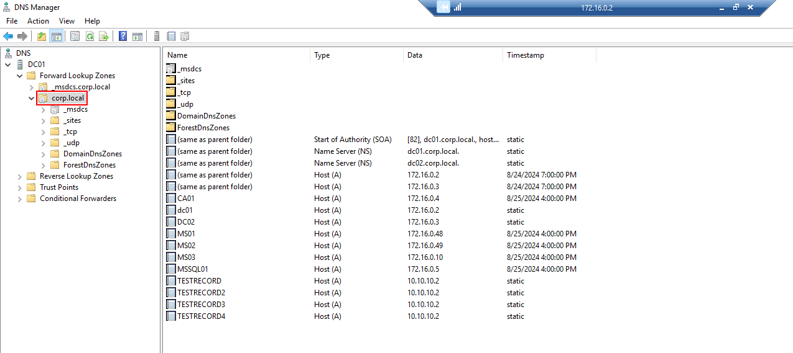
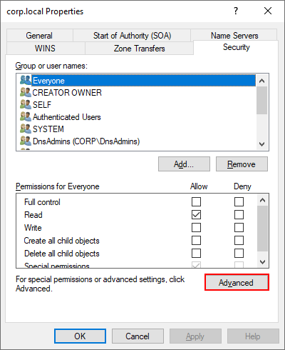
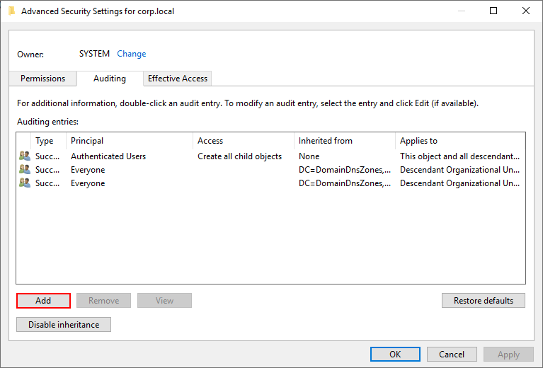
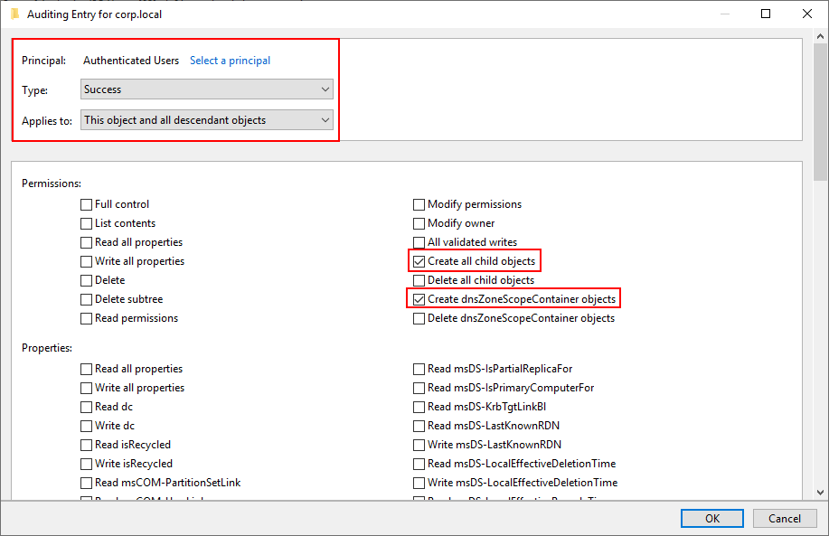

- Open the DNS manager and right click the zone you intend to audit (ie `corp.local`)

- Navigate to `Properties` > `Security`, then click on `Advanced` towards the bottom of the dialogue

- Navigate to the `Auditing` tab then click `Add`

- Fill in the following:
	- Use `Authenticated Users` as the `Principle` field
	- Type: `Success`
	- Applies to: `This object and all descendant objects`
- Scroll down to the bottom of the window, then click `Clear all`
- Finally configure the following permissions
	- `Create all child objects`
	- `Create dnsZoneScopeContainer objects`

- Click `OK`
- Click `Apply` then `OK`
- Click `OK`
