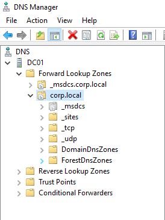
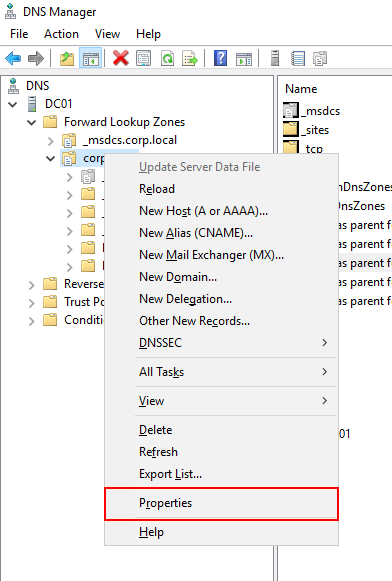
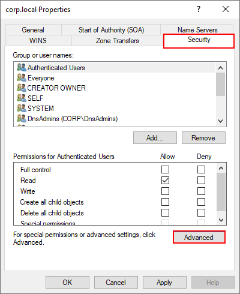
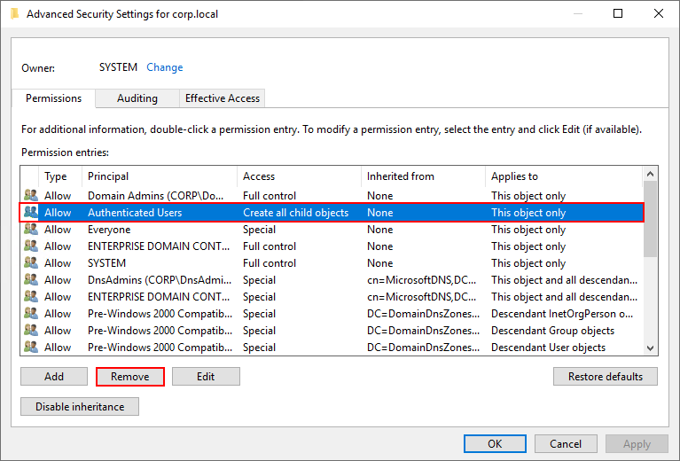

By default, Active Directory Domain Users can add static DNS entries to the domain. This can pose as a potential security threat, as having the ability to add arbitrary DNS entries to a domain could potentially be used to obfuscate adversary operations or facilitate attacks (such as an LDAP relay attack). Thankfully, restricting access to add DNS entries on an AD domain is very simple.

- Open the `DNS` snap in and navigate to the intended domain on the left pane

- Right click on the domain, then select `Properties`

- Navigate to the `Security` tab and click on `Advanced`

- Select the entry whose `Principal` is `Authenticated Users` and select `Remove`

- Click `Apply` then `OK`

Now, when a domain user (or adversary impersonating one) attempts to add a DNS record to the domain, they'll be denied access:

